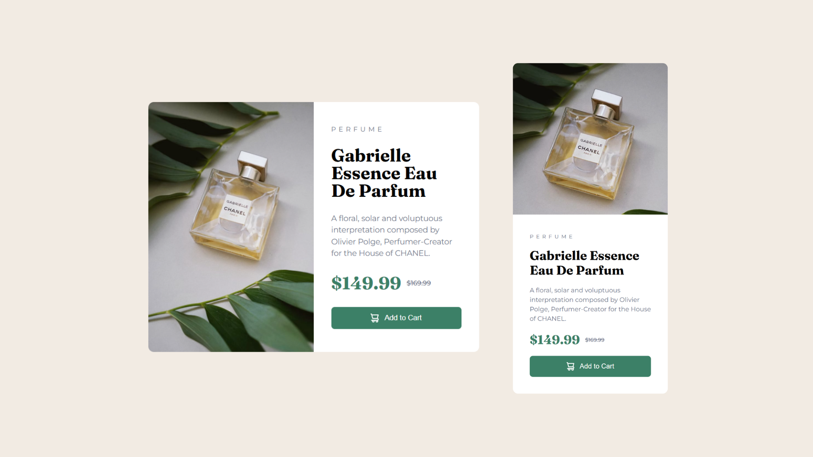

## Overview
This project is my solution to the Frontend Mentor Product Preview Card Component challenge. The goal was to recreate the provided design while ensuring the component remained responsive across different screen sizes.

### Development process
I started by building the HTML structure using semantic elements and organized my CSS using the BEM naming convention. The layout was created with Flexbox and later adjusted with media queries to support both mobile and desktop designs. I also used the <picture> element to serve different images based on screen size.

### Challenges faced
Making the card responsive was the most challenging part of this project. I found concepts such as widths, Flexbox layouts, and responsive design difficult to understand at first. I spent a significant amount of time experimenting with different approaches, testing breakpoints, and debugging layout issues before arriving at a solution that worked consistently across screen sizes.

### Key learnings
- Improved my understanding of Flexbox layouts and sizing.
- Learned how width behaves inside flex containers.
- Gained practical experience with responsive design and media queries.
- Used the <picture> element to serve responsive images.
- Applied the BEM methodology for the first time.
- Became more comfortable debugging CSS layout issues.

## Project
- Live Site URL: https://daxitaseervi.github.io/product-preview-card/

## Links
- Twitter/X: [https://x.com/kazzyyy__](https://x.com/kazzyyy__)
- Codepen: [https://codepen.io/Daxita-Seervi](https://codepen.io/Daxita-Seervi)
- Frontend Mentor: [https://www.frontendmentor.io/profile/daxitaseervi](https://www.frontendmentor.io/profile/daxitaseervi)